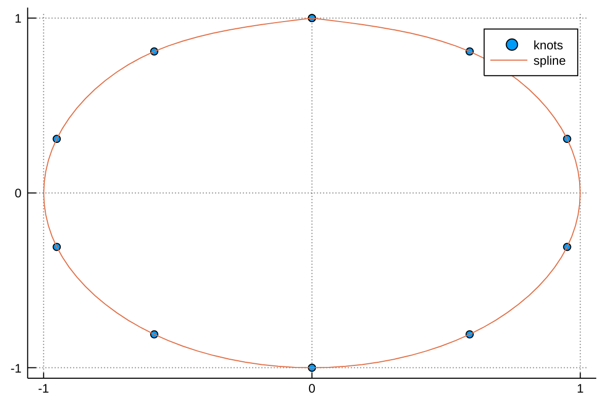
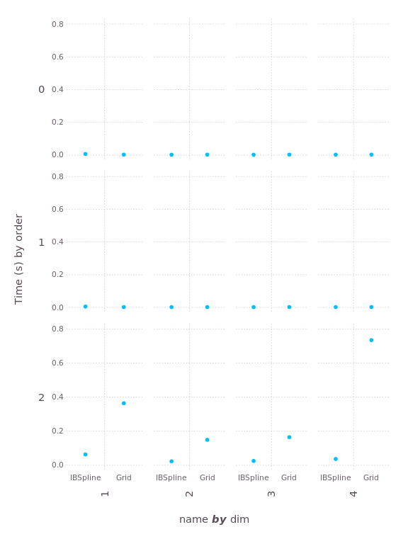
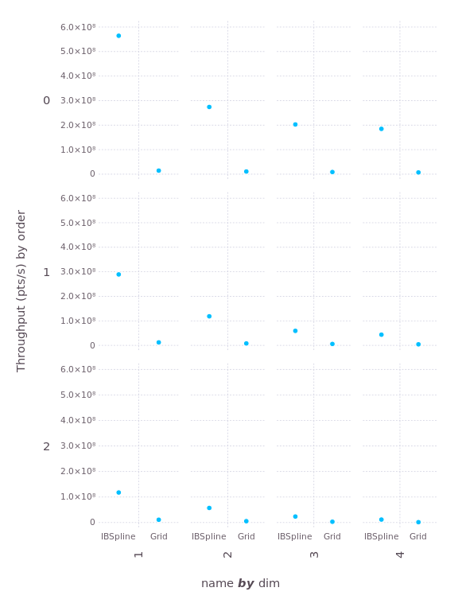
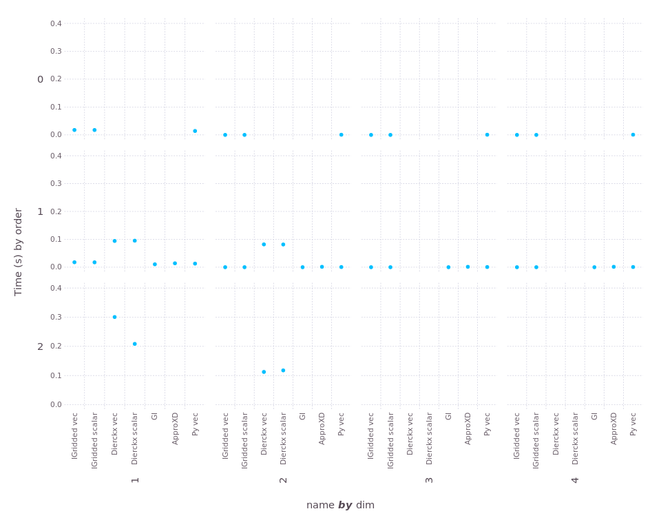
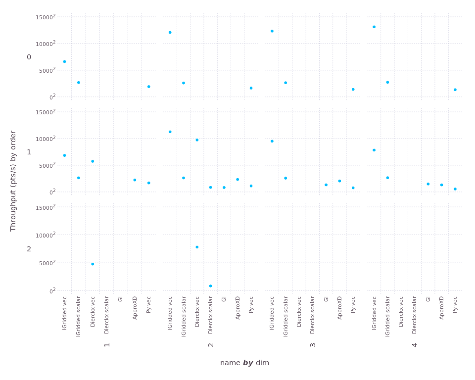

# Interpolations

[](https://travis-ci.org/JuliaMath/Interpolations.jl)
[](http://pkg.julialang.org/?pkg=Interpolations)
[](http://pkg.julialang.org/?pkg=Interpolations)

**NEWS** v0.9 was a breaking release. See the [news](NEWS.md) for details on how to update.

This package implements a variety of interpolation schemes for the
Julia language.  It has the goals of ease-of-use, broad algorithmic
support, and exceptional performance.

Currently this package's support is best
for [B-splines](https://en.wikipedia.org/wiki/B-spline) and also
supports irregular grids.  However, the API has been designed with
intent to support more options. Pull-requests are more than welcome!
It should be noted that the API may continue to evolve over time.

Other interpolation packages for Julia include:
- [Dierckx.jl](https://github.com/kbarbary/Dierckx.jl)
- [GridInterpolations.jl](https://github.com/sisl/GridInterpolations.jl)
- [ApproXD.jl](https://github.com/floswald/ApproXD.jl)

Some of these packages support methods that `Interpolations` does not,
so if you can't find what you need here, check one of them or submit a
pull request here.

At the bottom of this page, you can find a "performance shootout"
among these methods (as well as SciPy's `RegularGridInterpolator`).

## Installation

Just

```
Pkg.add("Interpolations")
```

from the Julia REPL.

## General usage

Note: the current version of `Interpolations` supports interpolation evaluation using index calls `[]`, but this feature will be deprecated in future. We highly recommend function calls with `()` as follows.

Given an `AbstractArray` `A`, construct an "interpolation object" `itp` as
```julia
itp = interpolate(A, options...)
```
where `options...` (discussed below) controls the type of
interpolation you want to perform.  This syntax assumes that the
samples in `A` are equally-spaced.

To evaluate the interpolation at position `(x, y, ...)`, simply do
```julia
v = itp(x, y, ...)
```

Some interpolation objects support computation of the gradient, which
can be obtained as
```julia
g = gradient(itp, x, y, ...)
```
or, if you're evaluating the gradient repeatedly, a somewhat more
efficient option is
```julia
gradient!(g, itp, x, y, ...)
```
where `g` is a pre-allocated vector.

Some interpolation objects support computation of the hessian, which
can be obtained as
```julia
h = hessian(itp, x, y, ...)
```
or, if you're evaluating the hessian repeatedly, a somewhat more
efficient option is
```julia
hessian!(h, itp, x, y, ...)
```
where `h` is a pre-allocated matrix.

`A` may have any element type that supports the operations of addition
and multiplication.  Examples include scalars like `Float64`, `Int`,
and `Rational`, but also multi-valued types like `RGB` color vectors.

Positions `(x, y, ...)` are n-tuples of numbers. Typically these will
be real-valued (not necessarily integer-valued), but can also be of types
such as [DualNumbers](https://github.com/JuliaDiff/DualNumbers.jl) if
you want to verify the computed value of gradients.
(Alternatively, verify gradients using [ForwardDiff](https://github.com/JuliaDiff/ForwardDiff.jl).)
You can also use
Julia's iterator objects, e.g.,

```julia
function ongrid!(dest, itp)
    for I in CartesianIndices(itp)
        dest[I] = itp(I)
    end
end
```
would store the on-grid value at each grid point of `itp` in the output `dest`.
Finally, courtesy of Julia's indexing rules, you can also use
```julia
fine = itp(range(1,stop=10,length=1001), range(1,stop=15,length=201))
```

### Quickstart guide

For linear and cubic spline interpolations, `LinearInterpolation` and `CubicSplineInterpolation` can be used to create interpolation objects handily:
```julia
f(x) = log(x)
xs = 1:0.2:5
A = [f(x) for x in xs]

# linear interpolation
interp_linear = LinearInterpolation(xs, A)
interp_linear(3) # exactly log(3)
interp_linear(3.1) # approximately log(3.1)

# cubic spline interpolation
interp_cubic = CubicSplineInterpolation(xs, A)
interp_cubic(3) # exactly log(3)
interp_cubic(3.1) # approximately log(3.1)
```
which support multidimensional data as well:
```julia
f(x,y) = log(x+y)
xs = 1:0.2:5
ys = 2:0.1:5
A = [f(x,y) for x in xs, y in ys]

# linear interpolation
interp_linear = LinearInterpolation((xs, ys), A)
interp_linear(3, 2) # exactly log(3 + 2)
interp_linear(3.1, 2.1) # approximately log(3.1 + 2.1)

# cubic spline interpolation
interp_cubic = CubicSplineInterpolation((xs, ys), A)
interp_cubic(3, 2) # exactly log(3 + 2)
interp_cubic(3.1, 2.1) # approximately log(3.1 + 2.1)
```
For extrapolation, i.e., when interpolation objects are evaluated in coordinates outside of range provided in constructors, the default option for a boundary condition is `Throw` so that they will return an error.
Interested users can specify boundary conditions by providing an extra parameter for `extrapolation_bc`:
```julia
f(x) = log(x)
xs = 1:0.2:5
A = [f(x) for x in xs]

# extrapolation with linear boundary conditions
extrap = LinearInterpolation(xs, A, extrapolation_bc = Line())

@test extrap(1 - 0.2) # ≈ f(1) - (f(1.2) - f(1))
@test extrap(5 + 0.2) # ≈ f(5) + (f(5) - f(4.8))
```
You can also use a "fill" value, which gets returned whenever you ask for out-of-range values:

```julia
extrap = LinearInterpolation(xs, A, extrapolation_bc = NaN)
@test isnan(extrap(5.2))
```

Irregular grids are supported as well; note that presently only `LinearInterpolation` supports irregular grids.
```julia
xs = [x^2 for x = 1:0.2:5]
A = [f(x) for x in xs]

# linear interpolation
interp_linear = LinearInterpolation(xs, A)
interp_linear(1) # exactly log(1)
interp_linear(1.05) # approximately log(1.05)
```

## Control of interpolation algorithm

### BSplines

The interpolation type is described in terms of *degree* and, if necessary, *boundary conditions*. There are currently four degrees available: `Constant`, `Linear`, `Quadratic`,  and `Cubic` corresponding to B-splines of degree 0, 1, 2, and 3 respectively.

B-splines of quadratic or higher degree require solving an equation system to obtain the interpolation coefficients, and for that you must specify a *boundary condition* that is applied to close the system. The following boundary conditions are implemented: `Flat`, `Line` (alternatively, `Natural`), `Free`, `Periodic` and `Reflect`; their mathematical implications are described in detail in the pdf document under `/doc/latex`.
When specifying these boundary conditions you also have to specify whether they apply at the edge grid point (`OnGrid()`)
or beyond the edge point halfway to the next (fictitious) grid point (`OnCell()`).

Some examples:
```julia
# Nearest-neighbor interpolation
itp = interpolate(a, BSpline(Constant()))
v = itp(5.4)   # returns a[5]

# (Multi)linear interpolation
itp = interpolate(A, BSpline(Linear()))
v = itp(3.2, 4.1)  # returns 0.9*(0.8*A[3,4]+0.2*A[4,4]) + 0.1*(0.8*A[3,5]+0.2*A[4,5])

# Quadratic interpolation with reflecting boundary conditions
# Quadratic is the lowest order that has continuous gradient
itp = interpolate(A, BSpline(Quadratic(Reflect(OnCell()))))

# Linear interpolation in the first dimension, and no interpolation (just lookup) in the second
itp = interpolate(A, (BSpline(Linear()), NoInterp()))
v = itp(3.65, 5)  # returns  0.35*A[3,5] + 0.65*A[4,5]
```
There are more options available, for example:
```julia
# In-place interpolation
itp = interpolate!(A, BSpline(Quadratic(InPlace(OnCell()))))
```
which destroys the input `A` but also does not need to allocate as much memory.

### Scaled BSplines

BSplines assume your data is uniformly spaced on the grid `1:N`, or its multidimensional equivalent. If you have data of the form `[f(x) for x in A]`, you need to tell Interpolations about the grid `A`. If `A` is not uniformly spaced, you must use gridded interpolation described below. However, if `A` is a collection of ranges or linspaces, you can use scaled BSplines. This is more efficient because the gridded algorithm does not exploit the uniform spacing. Scaled BSplines can also be used with any spline degree available for BSplines, while gridded interpolation does not currently support quadratic or cubic splines.

Some examples,
```julia
A_x = 1.:2.:40.
A = [log(x) for x in A_x]
itp = interpolate(A, BSpline(Cubic(Line(OnGrid()))))
sitp = scale(itp, A_x)
sitp(3.) # exactly log(3.)
sitp(3.5) # approximately log(3.5)
```

For multidimensional uniformly spaced grids
```julia
A_x1 = 1:.1:10
A_x2 = 1:.5:20
f(x1, x2) = log(x1+x2)
A = [f(x1,x2) for x1 in A_x1, x2 in A_x2]
itp = interpolate(A, BSpline(Cubic(Line(OnGrid()))))
sitp = scale(itp, A_x1, A_x2)
sitp(5., 10.) # exactly log(5 + 10)
sitp(5.6, 7.1) # approximately log(5.6 + 7.1)
```
### Gridded interpolation

These use a very similar syntax to BSplines, with the major exception
being that one does not get to choose the grid representation (they
are all `OnGrid`). As such one must specify a set of coordinate arrays
defining the knots of the array.

In 1D
```julia
A = rand(20)
A_x = collect(1.0:2.0:40.0)
knots = (A_x,)
itp = interpolate(knots, A, Gridded(Linear()))
itp(2.0)
```

The spacing between adjacent samples need not be constant, you can use the syntax
```julia
itp = interpolate(knots, A, options...)
```
where `knots = (xknots, yknots, ...)` to specify the positions along
each axis at which the array `A` is sampled for arbitrary ("rectangular") samplings.

For example:
```julia
A = rand(8,20)
knots = ([x^2 for x = 1:8], [0.2y for y = 1:20])
itp = interpolate(knots, A, Gridded(Linear()))
itp(4,1.2)  # approximately A[2,6]
```
One may also mix modes, by specifying a mode vector in the form of an explicit tuple:
```julia
itp = interpolate(knots, A, (Gridded(Linear()),Gridded(Constant())))
```

Presently there are only three modes for gridded:
```julia
Gridded(Linear())
```
whereby a linear interpolation is applied between knots,
```julia
Gridded(Constant())
```
whereby nearest neighbor interpolation is used on the applied axis,
```julia
NoInterp
```
whereby the coordinate of the selected input vector MUST be located on a grid point. Requests for off grid
coordinates results in the throwing of an error.

## Parametric splines

Given a set a knots with coordinates `x(t)` and `y(t)`, a parametric spline `S(t) = (x(t),y(t))` parametrized by `t in [0,1]` can be constructed with the following code adapted from a [post](http://julia-programming-language.2336112.n4.nabble.com/Parametric-splines-td37794.html#a37818) by Tomas Lycken:

```julia
using Interpolations

t = 0:.1:1
x = sin.(2π*t)
y = cos.(2π*t)
A = hcat(x,y)

itp = scale(interpolate(A, (BSpline(Cubic(Natural(OnGrid()))), NoInterp())), t, 1:2)

tfine = 0:.01:1
xs, ys = [itp(t,1) for t in tfine], [itp(t,2) for t in tfine]
```

We can then plot the spline with:

```julia
using Plots

scatter(x, y, label="knots")
plot!(xs, ys, label="spline")
```


## Extrapolation

The call to `extrapolate` defines what happens if you try to index into the interpolation object with coordinates outside of its
bounds in any dimension. The implemented boundary conditions are `Throw`, `Flat`, `Linear`, `Periodic` and `Reflect`,
or you can pass a constant to be used as a "fill" value returned for any out-of-bounds evaluation.
`Periodic` and `Reflect` require that there is a method of `Base.mod` that can handle the indices used.

Examples:

```
itp = interpolate(1:7, BSpline(Linear()))
etpf = extrapolate(itp, Flat())   # gives 1 on the left edge and 7 on the right edge
etp0 = extrapolate(itp, 0)        # gives 0 everywhere outside [1,7]
```

## Performance shootout

In the `perf` directory, you can find a script that tests
interpolation with several different packages.  We consider
interpolation in 1, 2, 3, and 4 dimensions, with orders 0
(`Constant`), 1 (`Linear`), and 2 (`Quadratic`).  Methods include
Interpolations `BSpline` (`IBSpline`) and `Gridded` (`IGridded`),
methods from the [Grid.jl](https://github.com/timholy/Grid.jl)
package, methods from the
[Dierckx.jl](https://github.com/kbarbary/Dierckx.jl) package, methods
from the
[GridInterpolations.jl](https://github.com/sisl/GridInterpolations.jl)
package (`GI`), methods from the
[ApproXD.jl](https://github.com/floswald/ApproXD.jl) package, and
methods from SciPy's `RegularGridInterpolator` accessed via `PyCall`
(`Py`).  All methods
are tested using an `Array` with approximately `10^6` elements, and
the interpolation task is simply to visit each grid point.

First, let's look at the two B-spline algorithms, `IBspline` and
`Grid`.  Here's a plot of the "construction time," the amount of time
it takes to initialize an interpolation object (smaller is better):



The construction time is negligible until you get to second order
(quadratic); that's because quadratic is the lowest order requiring
the solution of tridiagonal systems upon construction.  The solvers
used by Interpolations are much faster than the approach taken in
Grid.

Now let's examine the interpolation performance.  Here we'll measure
"throughput", the number of interpolations performed per second
(larger is better):



Once again, Interpolations wins on every test, by a factor that ranges
from 7 to 13.

Now let's look at the "gridded" methods that allow irregular spacing
along each axis.  For some of these, we compare interpolation performance in
both "vectorized" form `itp[xvector, yvector]` and in "scalar" form
`for y in yvector, x in xvector; val = itp[x,y]; end`.

First, construction time (smaller is better):



Missing dots indicate cases that were not tested, or not supported by
the package.  (For construction, differences between "vec" and
"scalar" are just noise, since no interpolation is performed during
construction.)  The only package that takes appreciable construction
time is Dierckx.

And here's "throughput" (larger is better). To ensure we can see the
wide range of scales, here we use "square-root" scaling of the y-axis:



For 1d, the "Dierckx scalar" and "GI" tests were interrupted because
they ran more than 20 seconds (far longer than any other test).  Both
performed much better in 2d, interestingly.  You can see that
Interpolations wins in every case, sometimes by a very large margin.


## Contributing

Work is very much in progress, but and help is always welcome. If you want to help out but don't know where to start, take a look at issue [#5 - our feature wishlist](https://github.com/JuliaMath/Interpolations.jl/issues/5) =) There is also some [developer documentation](doc/devdocs.md) that may help you understand how things work internally.

Contributions in any form are appreciated, but the best pull requests come with tests!
